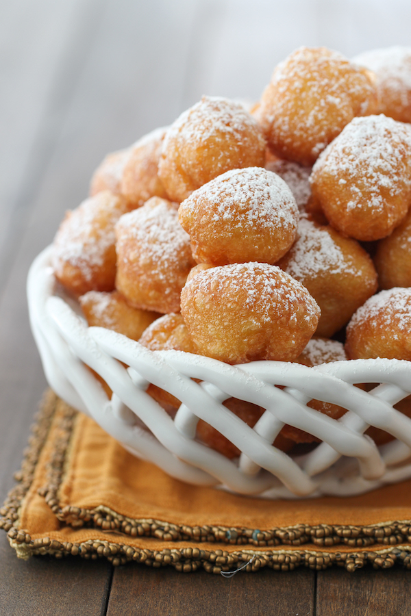

# Zippole

[Zippole](https://www.olgasflavorfactory.com/recipes/favorites/zeppole-italian-doughnuts/)

The wonders of pate a choux dough never ceases to amaze me. There are so many wonderful things you can make out of it – cream puffs,  eclairs, pastries, cake and even dumplings in soup. You can even deep fry it to make the most tender doughnuts.

The results are really crisp and light and one of the fluffiest doughnuts I had ever tried. It’s like biting into a delicious, creamy cloud. It’s also so easy and quick to prepare the batter, since you don’t have to wait for the yeast dough to rise, like you would for yeast doughnuts.